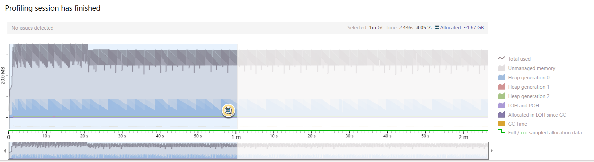
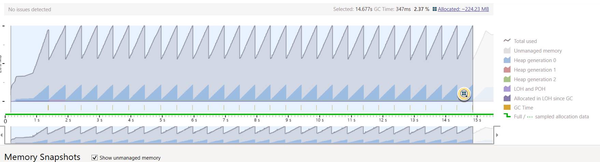
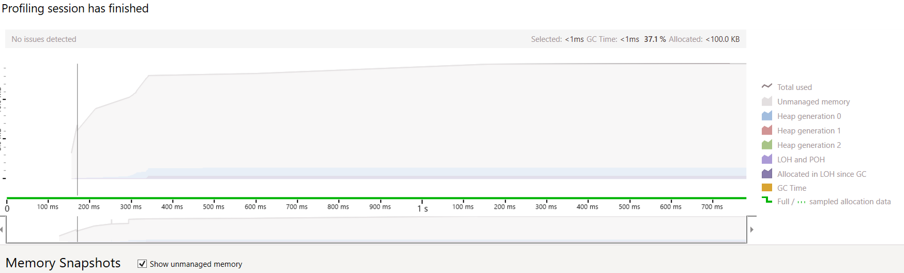

# MediatR Performance Benchmarks

A repository containing benchmarks and findings as mentioned in my [reddit post](https://www.reddit.com/r/csharp/comments/rxxg5m/mediatr_performance_benchmarks/).

The goal of these benchmarks is to see the potential overhead that is paid when 
using the MediatR package. Specifically, I am interested in the memory allocations.

## MediatR Benchmarks

### Setup, Command & Handler
First the setup for the benchmarks. Here is am using MediatR 10.0.0 and .NET 6.
```c#
private IMediator _mediator;
private ExampleCommandHandler _handler;

[GlobalSetup]
public void Setup()
{
    var services = new ServiceCollection();
    services.AddMediatR(typeof(Benchy));

    var provider = services.BuildServiceProvider();
    _mediator = provider.GetRequiredService<IMediator>();
    _handler = new ExampleCommandHandler();
}
```

The command and handler are just simple as can be, not really doing anything.
```c#
public class ExampleCommand : IRequest
{
    public ExampleCommand(string arg1, int arg2)
    {
        Arg1 = arg1;
        Arg2 = arg2;
    }
    
    public string Arg1 { get; }
    
    public int Arg2 { get; }
}

public class ExampleCommandHandler : IRequestHandler<ExampleCommand>
{
    /// <inheritdoc />
    public Task<Unit> Handle(ExampleCommand request, CancellationToken cancellationToken)
    {
        return Unit.Task;
    }
}
```

### Calling Handler with MediatR
Starting off with the first benchmark, we are using MediatR as intended creating a new command
and sending it off using a private mediator object.
```c#
[Benchmark]
public async Task CallingHandler_WithMediator()
{
    var command = new ExampleCommand("Example Arg", 2);
    await _mediator.Send(command, CancellationToken.None);
}
```

### Calling Handler Directly - Singleton
Here we are just calling an already created handler to test the performance overhead
that MediatR might add to calling a method directly.
```c#
[Benchmark]
public async Task CallingHandler_Directly()
{
    var command = new ExampleCommand("Example Arg", 2);
    await _handler.Handle(command, CancellationToken.None);
}
```

### Calling Handler Directly - Transient
Here here are trying the same as above, but now creating a new instance 
of the handler each call. To simulate a transient call.
```c#
[Benchmark]
public async Task CallingHandler_Directly_Transient()
{
    var handler = new ExampleCommandHandler();
    var command = new ExampleCommand("Example Arg", 2);
    await handler.Handle(command, CancellationToken.None);
}
```

### Results
```
// * Summary *

BenchmarkDotNet=v0.13.1, OS=Windows 10.0.22000
AMD Ryzen 9 3900XT, 1 CPU, 24 logical and 12 physical cores
.NET SDK=6.0.100
  [Host]     : .NET 6.0.0 (6.0.21.52210), X64 RyuJIT
  DefaultJob : .NET 6.0.0 (6.0.21.52210), X64 RyuJIT


|                            Method |      Mean |     Error |    StdDev |  Gen 0 | Allocated |
|---------------------------------- |----------:|----------:|----------:|-------:|----------:|
|       CallingHandler_WithMediator | 818.05 ns | 16.147 ns | 36.446 ns | 0.1621 |   1,360 B |
|           CallingHandler_Directly |  16.19 ns |  0.180 ns |  0.168 ns | 0.0038 |      32 B |
| CallingHandler_Directly_Transient |  15.91 ns |  0.247 ns |  0.231 ns | 0.0038 |      32 B |

```

The results show that calling the handler with MediatR seems to incur a relatively 
high overhead. Looking at the execution time MediatR is `50x` slower than calling the handler directly.

## MediatR Memory Tests
In the next set of tests I created a simple loop that calls a MediatR handler repeatedly. The command 
and handlers are the same as in the previous benchmarks.

```c#
var services = new ServiceCollection();
services.AddMediatR(typeof(ExampleCommand));

var provider = services.BuildServiceProvider();

var mediator = provider.GetRequiredService<IMediator>();

for (var i = 0; i < 1_000_000;i++)
{
    var command = new ExampleCommand("Test String", i);
    await mediator.Send(command);
}
```

Running this in release configuration and in dotMemory yields the following results:


Over `1.67 GB` of memory allocated in 1 min of execution time. With over 2 seconds of GC time.
After running some similar tests on another repo that I am an author of that uses concepts similar 
to the MediatR package. I believe that the the majority memory allocations are coming from:

1. The command being initialized (no option to create commands as structs)
2. The handler being transient, creating a new instance on each call

## Mapr & Similar Benchmarks

All of this got me thinking. I am the author of another repository [Mapr](https://github.com/rena0157/mapr) that uses a lot of the 
concepts of MediatR and applies them to object to object mapping.
So, I created some similar benchmarks and tests to see if I could reproduce the behavior.

### Setup

The setup is similar, using the default Microsoft IoC container.
```c#
private readonly IMap<string, int> _map;
private readonly IMapper _mapper;

public Bench()
{
    var services = new ServiceCollection();

    services.AddMapr(config =>
    {
        config.Scan<ExampleMap>();
    });

    var provider = services.BuildServiceProvider();
    
    _map = new ExampleMap();
    _mapper = provider.GetRequiredService<IMapper>();
}
```

Creating two maps, which are analogous to Handlers. With one having an attribute to register it as a singleton 
in the container.
```c#
public class ExampleMap : IMap<string, int>
{
    public int Map(string source)
    {
        return 0;
    }
}

[Map(Lifetime = MapLifetime.Singleton)]
public class ExampleSingletonMap : IMap<int, string>
{
    /// <inheritdoc />
    public string Map(int source)
    {
        return string.Empty;
    }
}
```

### Calling Map Using Mapper - Transient Map
Here just like in MediatR we are using the default behavior, calling a map using the default 
transient lifetime.
```c#
[Benchmark]
public void CallingMapper()
{
    _mapper.Map<string, int>("Test String");
}
```

### Calling Map Directly - Singleton
Here we are calling a map that has already been initialized
```c#
[Benchmark]
public void CallingMap()
{
    _map.Map("Test String");
}
```

### Calling Map Using Mapper - Singleton
```c#
[Benchmark]
public void Calling_SingletonMap()
{
    _mapper.Map<int, string>(23);
}
```

### Results
```
// * Summary *

BenchmarkDotNet=v0.13.1, OS=Windows 10.0.22000
AMD Ryzen 9 3900XT, 1 CPU, 24 logical and 12 physical cores
.NET SDK=6.0.100
  [Host]     : .NET 6.0.0 (6.0.21.52210), X64 RyuJIT
  DefaultJob : .NET 6.0.0 (6.0.21.52210), X64 RyuJIT


|               Method |      Mean |     Error |    StdDev |  Gen 0 | Allocated |
|--------------------- |----------:|----------:|----------:|-------:|----------:|
|        CallingMapper | 50.375 ns | 0.8114 ns | 0.7590 ns | 0.0029 |      24 B |
|           CallingMap |  1.430 ns | 0.0429 ns | 0.0401 ns |      - |         - |
| Calling_SingletonMap | 48.217 ns | 0.2427 ns | 0.2270 ns |      - |         - |

```

Again here, like with MediatR, we are seeing a large performance difference between calling a map directly and calling 
it through the mapper. The only difference is that we have the option to declare the map as a singleton. This completely removes 
the memory allocations.

## Mapr Memory Tests
Now, running the memory tests similar to MediatR. We get the following results:

### Registering the Map as transient


### Registering the Map as singleton


Almost no memory allocations, as to be expected. Also, very little GC time. With maps and handlers being focused on 
one method, handling or mapping. Registering maps and handlers as a Singleton seems to fix the issues that we are seeing in 
the Mapr repository. There is a possibility that a similar fix could be applied to MediatR as well. Which could drastically 
improve not only performance, but reduce the number of memory allocations.

Reference to Pull Request from mapr repo: [Mapr PR 18](https://github.com/rena0157/mapr/pull/18)

Any comments or suggestions are very welcome!